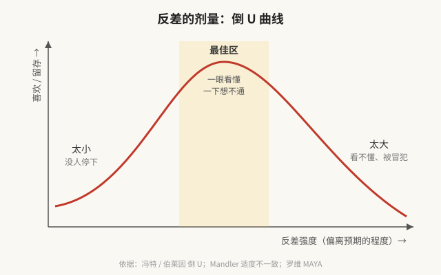

# 01 第一性原理：反差为什么有用

> 目标：不从"反差是什么技巧"出发，而是从"人脑怎么处理信息"出发，推出反差为什么必然有效、什么时候失效。

---

## 起点：三个底层事实

### 事实一：大脑是一台预测机器

人不是被动接收信息，而是**一直在猜下一秒会发生什么**，然后拿现实去对答案。认知科学里这叫"预测加工"（predictive processing）。

- 猜对了 → 大脑判定"没新东西"，直接放过。这就是为什么你对每天上班的路视而不见。
- 猜错了 → 产生"预测误差"，大脑立刻把注意力调过去，因为这里可能有需要更新的信息。

**证据**：
- Itti & Baldi 用数学定义了"惊奇"（观看者看到画面前后，脑中判断变化了多少），然后追踪人看电视和游戏时的视线：**72% 的视线跳转落在比平均更"惊奇"的位置**，四个人同时看向的地方这一比例升到 84%。他们的结论是：惊奇是目前已知的**最强的人类注意力吸引子**。[来源](https://pmc.ncbi.nlm.nih.gov/articles/PMC2782645/)
- 冯·雷斯托夫效应（1933）：一串相似的东西里混进一个不同的，那个不同的会被记得更牢。[来源](https://en.wikipedia.org/wiki/Von_Restorff_effect)
- 信息论（香农）：一条消息的信息量，等于它有多出乎意料。完全猜得到的话，信息量是零。

### 事实二：注意力有了，不等于喜欢、不等于留下

被打破预期后，人第一反应是**困惑**。困惑本身不舒服，大脑会急着去"修复"——找一个新的解释把这件怪事讲通。

- **修得好**：困惑一下变成"原来如此"，这一刻的快感就是笑、惊叹、顿悟。
- **修不好**：困惑留着，变成烦躁、反感、划走。

**证据**：
- 笑话的两阶段模型（Suls, 1972）：先发现不对劲，再找到让它合理的规则。**只有不对劲、没有解开，笑不出来。**[来源](https://link.springer.com/chapter/10.1007/978-1-4612-5572-7_3)
- 图式不一致理论（Mandler, 1982；Meyers-Levy & Tybout, 1989 验证）：新产品跟大家心里的品类印象**有点不一样**时评价最高；完全一样很平淡，差太远反而评价下降。是一条**倒 U 形曲线**。[来源](https://www.researchgate.net/publication/254316918_Understanding_schema_incongruity_as_a_process_in_advertising_Review_and_future_recommendations)
- 伯莱因（Berlyne, 1960/1971）把新奇、复杂、意外、不协调统称"对比变量"，也得出倒 U：中等刺激最让人愉快，太弱无聊，太强就厌恶。[来源](https://journals.sagepub.com/doi/10.1177/0305735617697507)
- 工业设计师罗维的 MAYA 原则："最先进，但还能被接受"。人同时怕旧和怕新。[来源](https://ixdf.org/literature/topics/maya-principle)
- 两千多年前亚里士多德在《诗学》里就说了：最能打动人的情节，是**出乎意料、却又彼此因果相连**的事件。光是意外不够，意外必须"讲得通"。[来源](https://www.perseus.tufts.edu/hopper/text?doc=Perseus:text:1999.01.0056:section%3D1452a)

### 事实三：任何反差都会被习惯掉

大脑会学习。同一种意外看多了，它就被纳入预测，不再是意外。

- 什克洛夫斯基（1917）说：习惯会吞掉一切，人对熟悉的东西只剩"认出"，不再"看见"。艺术的作用就是把熟悉的东西变陌生，"让石头重新有石头的质感"。[来源](https://en.wikipedia.org/wiki/Defamiliarization)
- 互联网上的直接证据：2013 年前后"好奇心缺口"式标题（"他做了一件事，结果你绝对想不到……"）流量奇高，很快所有人都用，观众学会了识别；Facebook 在 2014、2016 年两次改算法打压这类标题。[2014](https://about.fb.com/news/2014/08/news-feed-fyi-click-baiting/)、[2016](https://about.fb.com/news/2016/08/news-feed-fyi-further-reducing-clickbait-in-feed/)
- 老子的"反者道之动"在这里有了一个非常具体的意思：**主流一旦形成，它的反面就开始积蓄能量**。

---

## 推导：从三个事实推出反差的定义

**定义**：反差 = 观众的**预期**与你给出的**实际**之间的落差。

注意这个定义里的主角是**观众的预期**，不是你的内容本身。同一句话，对不同人群、在不同时间，反差完全不同。所以：

> **做反差的第一步不是想"我要怎么反"，而是搞清楚"他们默认什么"。**

### 反差的力量取决于什么

从事实一可以推出，反差抓注意力的强度大致取决于：

| 因素 | 含义 | 举例 |
|---|---|---|
| 预期有多牢 | 观众越笃定"本该如此"，打破时越响 | "豪车一定很吵很猛" → 罗尔斯·罗伊斯最响的是钟表声 |
| 偏离有多远 | 偏得越远越醒目（但受倒 U 限制） | 缺点直接当标题：大众汽车的"Lemon（次品）" |
| 揭示有多快 | 一瞬间翻过来，比慢慢转弯更有冲击 | 相声"抖"包袱的那一下 |

### 反差能不能留住人，取决于什么

从事实二推出：

| 因素 | 含义 |
|---|---|
| 解不解得开 | 观众能不能找到一个让这件怪事成立的解释 |
| 解开的成本 | 要想多久？短视频里超过一两秒就流失 |
| 解开后的回报 | 解释本身有没有新东西（一个洞察）——这决定了观众是"哦"还是"原来如此！" |

### 反差能用多久，取决于什么

从事实三推出：反差有**半衰期**。用的人越多、观众见得越多，它衰减越快。算法分发让这个半衰期变得极短。

---

## 结论：反差的完整结构是"打破 + 修复"

```
建立预期 → 打破预期 → 修复预期（给出新解释）
   铺垫          钩子           情节 + 洞察
```

这和你的 What / Why / How 框架是严丝合缝的：

- **钩子（What）**负责打破：一个让人"嗯？"的东西。
- **情节（Why）**负责带着观众去找解释。
- **洞察（How / 观点）**是最终那个解释——它让当初的反差"讲通了"。

而且这解释了你说的那句话："洞察是先有的，但你不会一开始就拿出来。"
原因是：**洞察本身是"修复"，它需要先有一个"破"才值钱。**直接说结论，观众没有困惑，就没有"原来如此"的快感，洞察也就显得平淡。所以要把洞察**翻过来**，先拿它的反面（或者它导致的那个怪现象）当钩子。

> 一句话：**钩子是洞察的反面，洞察是钩子的答案。**




---

## 第一性原理的三条推论（后面所有内容都从这里展开）

1. **反差是相对的**：相对于"这群人此刻的默认"。没有绝对的反差，只有对谁、在什么时候的反差。→ 所以要研究受众和平台的"默认值"（见 05）。
2. **反差要适量**：太小没人注意，太大没人看懂。最佳点是"一眼看懂、一下想不通"。→ 剂量问题（见 [README 结论](README.md)）。
3. **反差要还债**：打破预期等于借了观众的注意力，必须用解释和洞察还上，否则就是标题党，下一次没人信你。→ 风险问题（见 06）。
