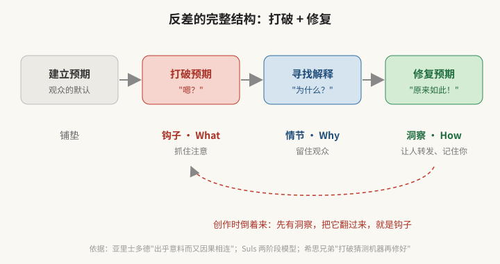

# 反差 · 结论先行

> 版本 v0.2（2026-10-06）· 先看判断，再看依据。研究过程在下面的 [研究地图](#研究地图)。
>
> 在 Will 的故事框架里，反差作用在**钩子**上：钩子（What）→ 情节（Why）→ 洞察（How）。

---

## 一、当下判断：现在该做什么反差

### 判断 1：这个时代的"平均值"是 AI 腔，反差的能量在"人"这一边

当下的默认 = **流畅、精致、正确、面面俱到、没有人味**。AI 和模板把它推成了新的平均值。
各平台的 2025 年度关键词全部指向反面：微博年度核心特征是"活人感"；小红书十大热词里有"活人感""反精致""主体性""抽象力"；短视频里手持粗糙的内容跑赢精致剪辑。（依据见 [07](07-当下趋势与人设反差.md)）

**所以大方向是：站在"人"这一边，对着"AI 平均腔"做反差。**

### 判断 2：但"看起来真实"马上会通胀，要做抄不走的那种真实

"活人感"已经变成营销词，品牌都在学着装活人，一两年内"刻意的粗糙"就会变成新模板。
长期站得住的是 AI 和模板**做不出来**的东西：

1. **过程**：你亲手做一件事的过程，包括失败
2. **代价**：会得罪人的立场
3. **品味**：在一堆"还行"里挑出"对的"那个判断
4. **积累**：几年攒下的专业眼光

### 判断 3：人设反差要有"敌人"，主张就是你要打倒的那一类东西

最强的人设反差都在反对一种具体的东西：Liquid Death 反"无聊的健康水"，胖东来反"内卷的老板"，DDB 反"吹嘘式广告"。
**主张 = 你站在哪边 + 你反对什么。**而且必须是真心的，否则会像东北雨姐一样，人设崩的时候反差翻成更大的负面。

### 判断 4：人设反差的公式

> **真实的特质 × 对着时代平均值 × 能持续产出 100 条**

缺"真"会崩，缺"反"没人看，缺"持续"火一阵就没了。

---

## 二、可以做的反差动作（给 Will 的初步建议）

> 基于目前已知的你：做过广告、欣赏伯恩巴克那一代人；不是程序员，但在用 AI 做应用；长期研究审美和独特性，反感均值化和 AI 腔。
> **这是初步判断**，等你补充个人特质（[07 第四节的表](07-当下趋势与人设反差.md#四给个人特质留的位置)）后再收窄。

### 推荐主轴：「用 AI 最多的人，最反对 AI 腔」

| | |
|---|---|
| **身份** | 一个天天用 AI 做东西的人（做应用、做研究、做内容） |
| **主张** | 反对平均。AI 越会写，人越要有自己的味道 |
| **敌人** | 均值化的内容：AI 腔、模板腔、"正确的废话" |
| **反差在哪** | A 主体反差：最懂 AI 的人站在"反 AI 平均"的一边。观众默认"用 AI 的人都在吹 AI"，你偏不 |
| **为什么能长期做** | AI 内容只会越来越多，平均值只会越来越平，你的"敌人"会一直在，而且越来越大 |
| **为什么是真的** | 你本来就反感 AI 腔、追求独特性——这是你已有的立场，不用演 |

**主张口号的候选**（Claude 原创，等你打磨）：
- 「AI 负责平均，我负责不平均」
- 「宁可偏，不要平」
- 「用 AI 的人，最该反 AI 腔」

### 两条辅助线（给主轴提供素材和证据）

1. **老广告的眼光看新流量**：用伯恩巴克、奥格威那代人的方法拆今天的爆款。
   - 反差：D 语境反差，60 年前的方法 × 今天的算法。
   - 口号候选：「流量密码，60 年前就写好了」
   - 前提：你确实有广告经历。这是抄不走的积累。
2. **不会写代码的人做产品（过程公开）**：用 AI 做应用的真实过程，包括踩坑。
   - 注意：vibe coding 已是柯林斯 2025 年度词，单纯"非程序员用 AI 做 App"正在变成平均值。所以**不要把它当主张**，只当"过程"素材，用来证明主轴：AI 能写代码，但"做成什么样"是你的审美决定的。

### 短视频怎么做

- **系列化格式**（可持续的关键）：「AI 会这么做 vs 我会这么做」
  - 0-1 秒：画面左右并置，左边 AI 的标准答案（精致、平均），右边你的版本（D 并置反差）
  - 1-3 秒：一句话钩子，把洞察翻过来说，比如"AI 写的这个标题，没有任何错误，所以没人会点"
  - 中段：拆为什么你的版本更好（修复）
  - 结尾：一句可以带走的判断（洞察）
- **形式**：真人出镜、手持、少剪辑——但**判断要锋利**。粗糙的形式 + 精准的判断，本身又是一层反差。
- 依据：手持口播内容跑赢精致剪辑；三翻四抖的节奏仍然有效。

### 文本怎么做

- **X**：平均值是夸张的 hot take。你的反差是**具体 + 克制**：用一个精确的细节或数字，代替"这改变了一切"。
- **小红书 / 微博**：平均值正在往"刻意的活人感"走。你的反差是**有判断的活人感**：不只是展示真实，还要给出一个别人没说过的判断。
- **公众号 / Substack**：适合放主轴的长内容，比如把这个反差研究本身写成系列，"一个广告人研究流量的笔记"。
- **通用句式**：
  - 「AI 会这么写：___。我会这么写：___。差别在于 ___。」
  - 「这条没有用 AI 写，因为 ___。」（只在真的没用时才说）
  - 「所有人都在 ___，我反而 ___，因为 ___。」

---

## 三、关于反差的五条底层判断（第一轮研究）

1. **反差的对象是观众的预期，不是主流本身。**"反"不等于唱反调。脱离了时代的默认，反差就消失了——这也是为什么今天看 60 年前的经典广告"没什么感觉"。
2. **反差只负责抓住，留住靠修复。**打破让人停下，修复让人留下，洞察让人转发。只打破不修复 = 标题党。
3. **最好的钩子不用另外找：把洞察翻过来就是。**深刻的洞察天然长得像反常识（"正言若反"）。
4. **反差要适量：一眼看懂，一下想不通。**太小没人停，太大没人懂（倒 U 曲线）。
5. **反差会过期，所以要找别人抄不走的来源。**真实经历、独特视角、专业积累。

---

## 四、做一条内容的六步法

1. **先有洞察**：观众最后要带走的那一句话是什么？
2. **列默认值**：目标观众对这个话题的 3 条默认想法（刷 10 分钟目标平台）
3. **找落差**：洞察打破了哪条默认？没打破，就从形式上找反差（C/D 类）
4. **选维度**（六选一，最多加一个辅助）：

   | | 打破什么 | 检查 |
   |---|---|---|
   | A 主体 | 谁在说 | 我的身份能不能成为反差？ |
   | B 内容 | 说什么 | 有没有反常识的事实/结论/价值翻转？ |
   | C 形式 | 怎么说 | 能不能换个反着的语气、尺度、手法？ |
   | D 语境 | 在哪说 | 能不能换个意想不到的场合或搭配？ |
   | E 结构 | 什么顺序 | 能不能铺一个预期再翻掉？ |
   | F 受众 | 对谁说 | 能不能说中他、或戳穿他？ |

5. **调剂量**：给外行看钩子——3 秒内能复述 + 复述完会追问"为什么" = 剂量对了
6. **按媒介落地 + 检查还债**（见 [05](05-媒介应用.md)、[06 自检表](06-风险与边界.md#一张自检表)）

**三格模板**（每条内容填一次）：

| 观众默认 | 我的洞察 | 钩子（洞察翻过来说） |
|---|---|---|
| 做流量就要夸张 | 越夸张欠债越多，具体比夸张更有力 | 「越想要流量，越不要夸张」 |
| 用 AI 的人都在吹 AI | AI 把平均变廉价，独特变稀缺 | 「AI 负责平均，我负责不平均」 |

---

## 研究地图

| 文件 | 回答的问题 | 状态 |
|---|---|---|
| [01 第一性原理](01-第一性原理.md) | 反差为什么有用？ | v0.1 |
| [02 分类体系](02-分类体系.md) | 从哪里发力？（MECE 六类 + 四个旋钮） | v0.1 |
| [03 思想谱系](03-思想谱系.md) | 古今中外的先贤怎么说？ | v0.1 |
| [04 时代演变](04-时代演变.md) | 不同媒介时代怎么用？ | v0.1 |
| [05 媒介应用](05-媒介应用.md) | 文本、图像、视频怎么做？ | v0.1，平台表待实测 |
| [06 风险与边界](06-风险与边界.md) | 什么时候会反噬？ | v0.1 |
| [07 当下趋势与人设反差](07-当下趋势与人设反差.md) | 现在该做什么？人设怎么选？ | **v0.2 新增** |
| [案例库](案例/案例库.md) | 近期案例 + 经典案例 | 近期优先，图片待补 |

## 研究日志

- **2026-10-06 第一轮**：第一性原理、MECE 分类、思想谱系、时代演变、媒介应用、风险，12 个经典案例。
- **2026-10-06 第二轮**：结论改为先行；新增当下趋势判断（AI 平均腔 vs 活人感）、人设反差公式、给 Will 的初步主张建议；案例库改为近期优先，新增 Duolingo、Ryanair、Liquid Death、胖东来、DeepSeek、东北雨姐。

## 下一步

- [ ] **Will 填个人特质表**（07 第四节）→ 收窄人设主张，从三个口号里定一个
- [ ] **试做**：用「AI 会这么做 vs 我会这么做」格式做 3 条短视频/帖子，看数据
- [ ] **平台实测**：各平台收集近 3 个月爆款，校准 05 的平台默认值
- [ ] **补图**：网络放开后下载案例图片
- [ ] **往后推进**：反差稳定后，进入"情节（Why）"——怎么修复
